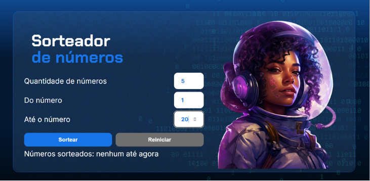

# Sorteador de Números 🎲

  

---

O **Sorteador de Números** é uma ferramenta web desenvolvida para facilitar a geração de números aleatórios dentro de um intervalo definido pelo usuário. O projeto foca na aplicação prática de lógica de programação, manipulação do DOM e validação de estados de interface.

## 🚀 Tecnologias

Este projeto foi desenvolvido utilizando as seguintes tecnologias:

* **HTML5**: Estruturação dos campos de entrada e botões da interface.
* **CSS3**: Estilização responsiva e estados visuais (botão habilitado/desabilitado).
* **JavaScript (ES6+)**: Implementação da lógica de sorteio, verificação de números repetidos e controle de fluxo.

---

## 💻 Projeto

A aplicação permite que o usuário:
1.  Defina a **quantidade** de números a serem sorteados.
2.  Estabeleça o intervalo numérico (**Do número** ao **Até o número**).
3.  Visualize os resultados em tempo real na tela.
4.  Reinicie o sorteio e limpe todos os campos de entrada.

---

## 🛠️ Funcionalidades Técnicas

O código contém soluções para desafios comuns de desenvolvimento:

* **Prevenção de Duplicatas**: Utiliza um laço `while` e o método `includes` para garantir que o mesmo número não seja sorteado mais de uma vez na mesma rodada.
* **Alternância de Estados (Toggle)**: A função `alterarStatusBotao` gerencia as classes CSS do botão "Reiniciar", mudando sua aparência e disponibilidade conforme o status do sorteio.
* **Manipulação de Tipos**: Uso de `parseInt` para garantir que as entradas do usuário sejam tratadas como números inteiros em cálculos matemáticos.

---

## 🎨 Interface

O design conta com uma paleta de cores moderna e elementos visuais que indicam clareza no uso:
* Campos de input específicos para números.
* Uso de fontes personalizadas via Google Fonts (Chakra Petch e Inter).
* Feedback textual direto para o usuário sobre os resultados do sorteio.

(Criado pela Alura)

---

## 🤝 Contato

**Rodrigo Jatobá** 

---

**Desenvolvido por Rodrigo Jatobá** *durante as aulas da Alura.*
